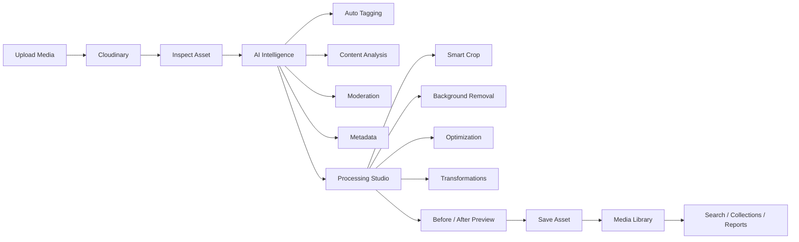
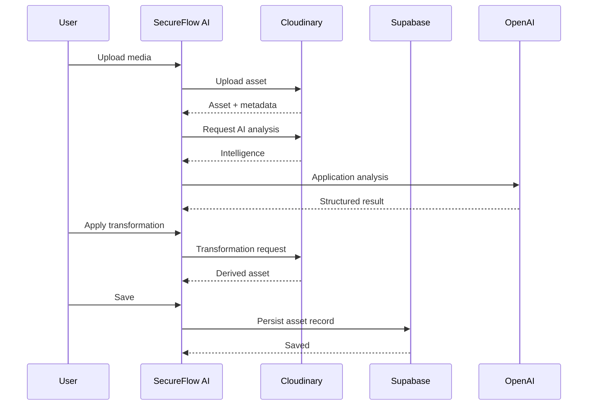
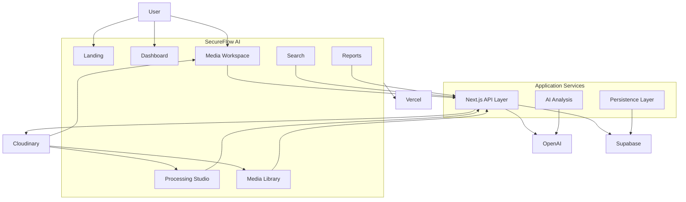

# SecureFlow AI
### Cloudinary-powered AI Media Intelligence & Processing Platform

SecureFlow AI transforms raw media into intelligent, searchable, optimized,
and reusable assets through one continuous workflow.

**Upload → Analyze → Process → Transform → Optimize → Save**

[Live Demo] · [Demo Video] · [GitHub Repository]

Built for the **Pixels to Products — Cloudinary AI Hackathon 2026**

**Team Build Bros**

---

## What is SecureFlow AI?

SecureFlow AI is a unified media intelligence workspace that combines
Cloudinary-powered media infrastructure, AI analysis, intelligent
transformations, optimization, and asset management into one product.

Instead of moving media between multiple tools, users can upload an asset,
understand its contents, process it, optimize it, and save the resulting asset
from a single workflow.

---

## Core Product Workflow



---

## Why Cloudinary?

Cloudinary is the media infrastructure layer behind SecureFlow AI.

The application uses Cloudinary to support the complete media lifecycle:

| Requirement | Cloudinary Capability | SecureFlow AI |
|---|---|---|
| Media Upload | Upload infrastructure | Media Workspace |
| Media Delivery | CDN / transformed delivery | Asset Preview |
| AI Analysis | AI content analysis | Intelligence Panel |
| Auto Tagging | AI tagging | Searchable Metadata |
| Moderation | Content moderation | Safety Status |
| Smart Cropping | Content-aware transformations | Smart Crop |
| Background Removal | AI background removal | Processing Studio |
| Optimization | Format / quality transformations | Optimization Studio |
| Transformations | Transformation pipeline | Transform Studio |

Cloudinary therefore acts as the application's media storage, intelligence,
transformation, and delivery foundation.

---

## AI Media Intelligence

SecureFlow AI doesn't treat an uploaded image as a simple file.

After upload, the application can build an intelligence layer around the
asset.

### Intelligence Pipeline

Upload
↓
Metadata Extraction
↓
AI Analysis
↓
Auto Tagging
↓
Moderation
↓
Structured Intelligence
↓
Search / Processing / Reporting

| Intelligence | Purpose |
|---|---|
| Metadata | Understand the technical asset |
| AI Tags | Categorize visual content |
| Confidence | Quantify tag relevance |
| Moderation | Surface content-safety status |
| Captioning | Describe visual content when configured |
| Search Signals | Improve asset discovery |

---

## AI Processing Studio

SecureFlow AI provides focused processing experiences for:

- Smart Crop
- Background Removal
- Optimization
- Transform Studio

```text
                 PROCESSING STUDIO
                         |
        +----------------+----------------+
        |                |                |
        v                v                v
   SMART CROP      BACKGROUND        OPTIMIZATION
                      REMOVAL
        |                |                |
        +----------------+----------------+
                         |
                         v
                  TRANSFORM STUDIO
                         |
                         v
                   DERIVED ASSET
```

---

## Media Workspace

The Media Workspace is the primary product experience.

It combines the complete asset lifecycle into a single interactive workflow:

### 01 — Upload
Drag and drop media into the workspace.

### 02 — Inspect
Review dimensions, format, size, and asset information.

### 03 — Analyze
Run AI intelligence and review tags, confidence, moderation, and analysis.

### 04 — Process
Apply Smart Crop, Background Removal, Optimization, or transformations.

### 05 — Preview
Compare the original and processed output.

### 06 — Save
Persist the resulting asset into the Media Library.



---

## Architecture



---

## Feature Overview & Business Value

| Category | Feature | Product Story | Implementation |
|---|---|---|---|
| Media | Upload | Ingest media securely directly from the UI | Cloudinary |
| Intelligence | AI Analysis | Turn static files into structured, understood media intelligence | Cloudinary / OpenAI |
| Intelligence | Auto Tagging | Make assets instantly discoverable without manual tagging | Cloudinary |
| Intelligence | Moderation | Maintain platform safety automatically at the ingestion layer | Cloudinary |
| Processing | Smart Crop | **Eliminate manual reframing by using content-aware transformations to adapt a single asset to different aspect ratios.** | Cloudinary transformations |
| Processing | Background Removal | **Isolate the visual subject without requiring the user to export the asset to a separate image editor.** | Cloudinary |
| Processing | Optimization | **Deliver the same source asset in an appropriate format and quality without maintaining multiple manually exported versions.** | Cloudinary |
| Processing | Transform Studio | Apply dynamic adjustments without leaving the workflow | Cloudinary transformations |
| Management | Media Library | Centralize all processed, tagged, and analyzed assets | Application + Supabase |
| Management | Search | Discover assets using AI-generated tags and metadata | Application metadata |
| UX | Page transitions | Provide a seamless, native-app feel | Framer Motion |
| Deployment | Production | Scalable global delivery | Vercel |

---

## Technology Stack

- **Framework:** Next.js 14 (App Router)
- **Language:** TypeScript
- **Media & Transformation:** Cloudinary
- **Database & Persistence:** Supabase (PostgreSQL)
- **AI Reasoning:** OpenAI (GPT-4o)
- **Styling:** Tailwind CSS, Framer Motion

---

## Security

- Environment variables strictly segregate public and private keys.
- Supabase Row Level Security (RLS) and Service Role configurations handle sensitive backend persistence.
- Cloudinary moderation acts as a first line of defense against inappropriate or malicious media content.

---

## Installation

1. Clone the repository
2. Install dependencies:
   ```bash
   npm install
   ```

## Environment Variables

Create a `.env.local` file in the root directory and ensure the following variables are set on Vercel:

```env
NEXT_PUBLIC_CLOUDINARY_CLOUD_NAME=
NEXT_PUBLIC_CLOUDINARY_UPLOAD_PRESET=
NEXT_PUBLIC_CLOUDINARY_API_KEY=
CLOUDINARY_API_SECRET=
NEXT_PUBLIC_SUPABASE_URL=
NEXT_PUBLIC_SUPABASE_ANON_KEY=
SUPABASE_SERVICE_ROLE_KEY=
OPENAI_API_KEY=
```

---

## Documentation

Please refer to the `/documentation` directory for architectural diagrams, expected UX states, and the hackathon submission demo script.

---

## Team

| Member | GitHub | LinkedIn | Portfolio |
|---|---|---|---|
| Rishvin Reddy | [RishvinReddy](https://github.com/RishvinReddy) | [LinkedIn](https://www.linkedin.com/in/rishvinreddy/?isSelfProfile=false) | [Portfolio](https://rishvinreddy.vercel.app/) |
| Navari Yashwanth Reddy | [YashwanthNavari](https://github.com/YashwanthNavari) | [LinkedIn](https://www.linkedin.com/in/navari-yashwanth-reddy-4a7065357/?isSelfProfile=true) | [Portfolio](https://navariyashwanthreddy.vercel.app/) |
| Pocharam Gayathri | [Gayathripocharam](https://github.com/Gayathripocharam) | [LinkedIn](https://www.linkedin.com/in/gayathripocharam/) | [Portfolio](https://gayathripocharam.github.io/) |
| Guggilla Yogamruth Reddy | [YogamruthReddy](https://github.com/YogamruthReddy) | [LinkedIn](https://www.linkedin.com/in/guggilla-yogamruth-reddy-109033324/?isSelfProfile=false) | — |
