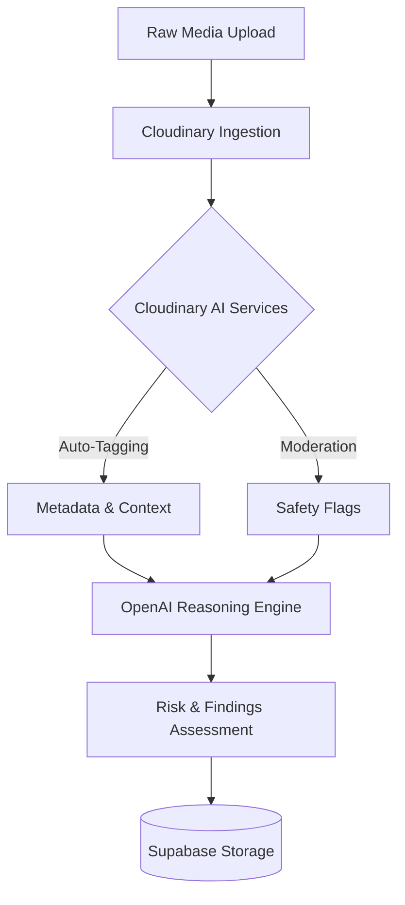

# SecureFlow AI

> Cloudinary-powered AI media intelligence and processing platform.

[Live Demo](YOUR_VERCEL_URL) · [GitHub Repository](YOUR_REPOSITORY_URL)

## Live Demo
Check out the live deployment of SecureFlow AI on Vercel:
[Demo Link placeholder]

## Demo Video
Watch a full walkthrough of our media pipeline in action:
[Video Link placeholder]

## Hackathon
Built for the **Pixels to Products — Cloudinary AI Hackathon 2026**.

## Problem
Organizations handle vast amounts of visual evidence and media daily. Traditional dashboards treat media as static files, relying on human analysts to manually tag, crop, review, and extract intelligence. This leads to bottlenecks, missed insights, and inconsistent moderation, leaving analysts without a unified tool to process and reason over media at scale.

## Solution
SecureFlow AI provides a unified Media Workspace where every piece of ingested evidence is immediately analyzed, tagged, and moderated. It acts as an interactive command center, allowing analysts to instantly apply content-aware smart cropping, background removal, and optimizations using Cloudinary's dynamic transformations, while an AI reasoning engine infers physical and digital risks in real-time.

## Why Cloudinary
Cloudinary acts as the core pipeline engine for SecureFlow AI, removing the need for a fragmented media toolchain. Instead of using disparate services for upload, transformation, and AI tagging, Cloudinary powers every stage from ingestion to optimized delivery.

## Core Features
- **Media Upload:** Scalable and secure uploading of media directly to Cloudinary.
- **AI Intelligence:** Automated extraction of metadata, tags, and safety states upon ingestion.
- **Smart Crop:** Content-aware transformations tailored for investigative precision using AI gravity detection.
- **Background Removal:** Seamless subject isolation via `e_background_removal`.
- **Optimization:** Intelligent delivery using Cloudinary's `f_auto` and `q_auto` parameters.
- **Transformations:** Real-time application of CDN-level URL transformations.
- **Search:** Query capabilities over extensive metadata, AI tags, and inferred findings.
- **Media Library:** A robust management system for processed assets.
- **Reports:** Generation of insights from AI reasoning payload.

## Product Workflow
Upload → Cloudinary → AI analysis → Auto tagging → Moderation → Smart Crop → Background Removal → Optimization → Transformations → Save → Media Library.

## System Architecture
The system employs an event-driven architecture designed to process media synchronously and asynchronously, separating ingestion, intelligence extraction, and persistence.

## AI Processing Pipeline
The AI pipeline orchestrates the flow of data from raw pixels to structured intelligence.



## Cloudinary Integration
* **Upload:** Utilizes Cloudinary's secure upload mechanisms.
* **AI Analysis:** Triggers Vision API and auto-tagging on asset creation.
* **Moderation:** Integrates with Cloudinary moderation capabilities to enforce safety.
* **Delivery & Transformations:** Applies real-time CDN-level transformations (`e_background_removal`, `c_auto`, `g_auto`, `f_auto`, `q_auto`).

## Technology Stack
- **Framework:** Next.js 14 (App Router)
- **Language:** TypeScript
- **Media & Transformation:** Cloudinary
- **Database & Persistence:** Supabase (PostgreSQL)
- **AI Reasoning:** OpenAI (GPT-4o)
- **Styling:** Tailwind CSS, Framer Motion

## Security
- Environment variables strictly segregate public and private keys.
- Supabase Row Level Security (RLS) and Service Role configurations handle sensitive backend persistence.
- Cloudinary moderation acts as a first line of defense against inappropriate or malicious media content.

## Documentation
Please refer to the `/documentation` directory for architectural diagrams and expected UX states.

## Team

| Member | Role | GitHub | LinkedIn | Portfolio |
|---|---|---|---|---|
| Rishvin Reddy | Product / Engineering | [RishvinReddy](https://github.com/RishvinReddy) | [LinkedIn](https://www.linkedin.com/in/rishvinreddy/?isSelfProfile=false) | [Portfolio](https://rishvinreddy.vercel.app/) |
| Navari Yashwanth Reddy | Engineering | [YashwanthNavari](https://github.com/YashwanthNavari) | [LinkedIn](https://www.linkedin.com/in/navari-yashwanth-reddy-4a7065357/?isSelfProfile=true) | [Portfolio](https://navariyashwanthreddy.vercel.app/) |
| Pocharam Gayathri | Engineering | [Gayathri-Pocharam](https://github.com/Gayathri-Pocharam) | [LinkedIn](https://www.linkedin.com/in/gayathripocharam/) | — |
| Guggilla Yogamruth Reddy | Engineering | [yogamruth](https://github.com/yogamruth) | [LinkedIn](https://www.linkedin.com/in/guggilla-yogamruth-reddy-109033324/?isSelfProfile=false) | [Portfolio](https://yogamruthreddy.vercel.app/) |

## Installation

1. Clone the repository
2. Install dependencies:
   ```bash
   npm install
   ```

## Environment Variables
Create a `.env.local` file in the root directory and ensure the following variables are set on Vercel:

```env
NEXT_PUBLIC_CLOUDINARY_CLOUD_NAME=
NEXT_PUBLIC_CLOUDINARY_UPLOAD_PRESET=
NEXT_PUBLIC_CLOUDINARY_API_KEY=
CLOUDINARY_API_SECRET=
NEXT_PUBLIC_SUPABASE_URL=
NEXT_PUBLIC_SUPABASE_ANON_KEY=
SUPABASE_SERVICE_ROLE_KEY=
OPENAI_API_KEY=
```

## License
MIT License
