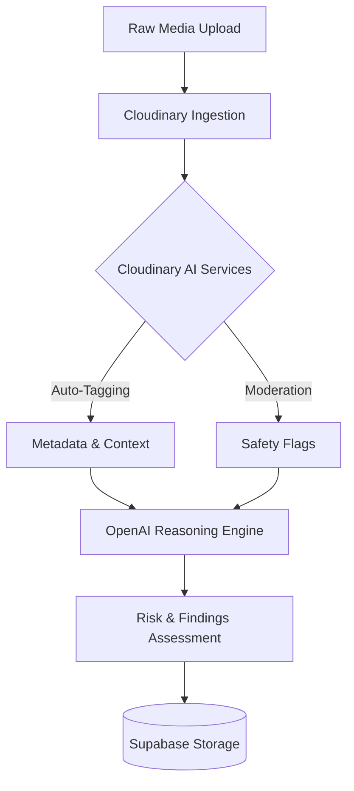
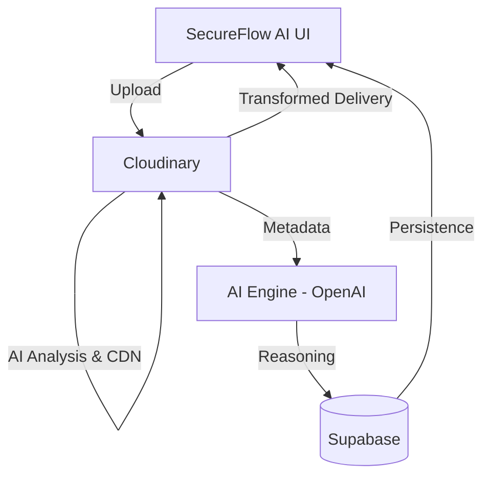

# SecureFlow AI

## Project Overview
SecureFlow AI is a production-grade media intelligence platform that transforms raw, static media into actionable, searchable, and intelligent assets. It leverages Cloudinary's media infrastructure for AI-powered processing and OpenAI for advanced security reasoning.

## Problem
Organizations handle vast amounts of visual evidence and media daily. Traditional dashboards treat media as static files, relying on human analysts to manually tag, crop, review, and extract intelligence. This leads to bottlenecks, missed insights, and inconsistent moderation, leaving analysts without a unified tool to process and reason over media at scale.

## Solution
SecureFlow AI provides a unified Media Workspace where every piece of ingested evidence is immediately analyzed, tagged, and moderated. It acts as an interactive command center, allowing analysts to instantly apply content-aware smart cropping, background removal, and optimizations using Cloudinary's dynamic transformations, while an AI reasoning engine infers physical and digital risks in real-time.

## Key Features
* **Smart Media Ingestion:** Scalable and secure uploading of media directly to Cloudinary.
* **Intelligent Media Workspace:** A 3-panel studio interface (Command Center, Canvas, Controls) for real-time asset processing.
* **AI Auto-Tagging & Moderation:** Automated extraction of metadata, tags, and safety states upon ingestion.
* **Smart Crop & Background Removal:** Content-aware transformations tailored for investigative precision.
* **Format & Quality Optimization:** Intelligent delivery using Cloudinary's f_auto and q_auto parameters.
* **Security Reasoning Engine:** Automated inference of risks based on detected media metadata.
* **Evidence Management:** A robust library for searching, filtering, and reporting on media assets.

## Product Architecture
The system employs an event-driven architecture designed to process media synchronously and asynchronously, separating ingestion, intelligence extraction, and persistence.

## Cloudinary Integration
Cloudinary is not treated merely as a storage bucket. It acts as the core pipeline engine for SecureFlow AI.
* **Upload:** Utilizes Cloudinary's secure upload mechanisms.
* **AI Analysis:** Triggers Vision API and auto-tagging on asset creation.
* **Moderation:** Integrates with Cloudinary moderation capabilities to enforce safety.
* **Delivery & Transformations:** Applies real-time CDN-level transformations (e_background_removal, c_auto, g_auto, f_auto, q_auto) for the derived output assets.

## AI Pipeline
The AI pipeline orchestrates the flow of data from raw pixels to structured intelligence.



## Media Workspace
The Media Workspace is the visual centerpiece of SecureFlow AI. Rather than jumping between disparate tools, users remain in a continuous flow: Upload -> Inspect -> Transform -> Optimize -> Save.

## AI Processing
AI Processing integrates directly with Cloudinary's dynamic URL transformations. The application visually constructs these transformation URLs in real-time, allowing users to apply content-aware Smart Cropping (using AI gravity detection) and Background Removal dynamically.

## Search & Media Management
All assets are persisted into a structured Media Library. Search operates over the extensive metadata, AI tags, and inferred findings generated during the initial ingestion phase.

## Analytics
The platform aggregates operational data to display real-time metrics in the Command Center, tracking pipeline health, AI detection rates, and system throughput.

## Security Architecture
* Environment variables strictly segregate public and private keys.
* Supabase Row Level Security (RLS) and Service Role configurations handle sensitive backend persistence.
* Cloudinary moderation acts as a first line of defense against inappropriate or malicious media content.

## Data Model
The persistence layer (Supabase) tracks three core entities:
* **Evidence:** Stores the Cloudinary Asset ID, Public ID, Secure URL, and technical metadata.
* **Analyses:** Links to evidence and stores the AI reasoning payload (risk score, severity, status).
* **Observations/Risks:** Derived findings strictly mapped to their parent analysis.

## Technology Stack
* **Framework:** Next.js 14 (App Router)
* **Language:** TypeScript
* **Media & Transformation:** Cloudinary
* **Database & Persistence:** Supabase (PostgreSQL)
* **AI Reasoning:** OpenAI (GPT-4o)
* **Styling:** Tailwind CSS

## Installation

1. Clone the repository
2. Install dependencies:
   ```bash
   npm install
   ```

## Environment Variables
Create a `.env.local` file in the root directory.

```env
NEXT_PUBLIC_CLOUDINARY_CLOUD_NAME=your_cloud_name
NEXT_PUBLIC_CLOUDINARY_UPLOAD_PRESET=your_preset
NEXT_PUBLIC_CLOUDINARY_API_KEY=your_api_key
CLOUDINARY_API_SECRET=your_api_secret

NEXT_PUBLIC_SUPABASE_URL=your_supabase_url
NEXT_PUBLIC_SUPABASE_ANON_KEY=your_anon_key
SUPABASE_SERVICE_ROLE_KEY=your_service_role_key

OPENAI_API_KEY=your_openai_key
```

## Local Development
Start the local Next.js development server:
```bash
npm run dev
```
Navigate to http://localhost:3000 to access the Command Center.

## Production Deployment
The application is designed for edge-compatible deployment on Vercel. Ensure all environment variables are populated in the Vercel project settings prior to building.

## Demo Workflow
1. Navigate to the Media Workspace.
2. Upload a piece of visual evidence.
3. Observe the real-time AI intelligence extraction (Tags, Moderation).
4. Apply Smart Cropping and Background Removal.
5. Review the Cloudinary Delivery URL.
6. Save the derived asset to the Media Library.
7. Search for the asset using its AI-generated tags.

## Limitations
* Background Removal requires the Cloudinary AI Background Removal add-on to be enabled on the host account.
* Moderation states depend on the exact moderation add-on configured in the Cloudinary preset.

## Cloudinary Capabilities Used

| Capability | Cloudinary Feature | Application Integration | Status |
|---|---|---|---|
| Upload | Upload API | Media Workspace | Implemented |
| Auto-tagging | AI Analysis | Intelligence Panel | Implemented |
| Moderation | Moderation Integration | Safety Status | Configuration-dependent |
| Smart Crop | AI Gravity | Processing Studio | Implemented |
| Background Removal | e_background_removal | Processing Studio | Configuration-dependent |
| Optimization | f_auto, q_auto | Optimization Studio | Implemented |
| Search | Metadata/Tags | Search Console | Implemented |
| Transformations | URL Parameters | Transform Studio | Implemented |
| Analytics | Asset Metadata | Dashboard | Implemented |
| Persistence | — | Supabase | Implemented |

## Screenshots
Please refer to the `/documentation` directory for architectural diagrams and expected UX states.

## Architecture Diagram



## Future Scope
* Expansion to Video Intelligence (automatic highlight generation).
* Real-time streaming analysis.
* Custom trained models for specialized security domains.

## Hackathon Track
Cloudinary AI Hackathon 2026.

## Credits
Rishvin Reddy - Founder / Developer

## License
MIT License
