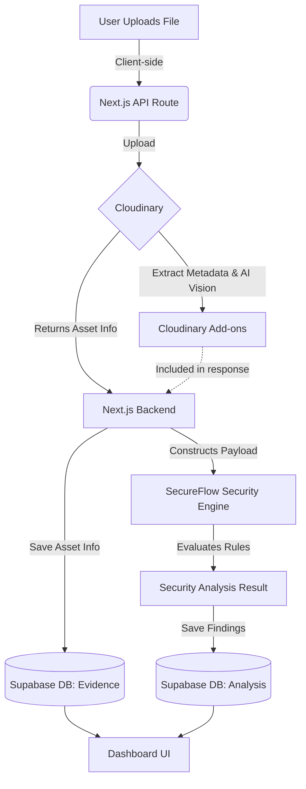

# Data Flow Architecture

This document describes the flow of data through the SecureFlow AI application, from user upload to final visualization.

## High-Level Data Flow

## Detailed Flow Steps

### 1. Ingestion Phase
- User initiates an upload from the **Media Workspace** or **New Analysis** page.
- The file is sent to the `/api/media/upload` endpoint.

### 2. Storage & AI Vision Phase
- The backend forwards the file to **Cloudinary**.
- Cloudinary stores the file and applies requested transformations (e.g., smart cropping, background removal).
- Cloudinary's AI add-ons (Google Auto Tagging, OCR, WebPurify Moderation) analyze the media.
- Cloudinary returns a comprehensive response including a secure URL, metadata, and intelligence data.

### 3. Security Analysis Phase
- The `/api/security/analyze` endpoint is triggered with the Cloudinary response payload.
- The **SecureFlow Rule Engine** processes the payload, evaluating it against predefined security rules (credentials, malware, content moderation).
- The engine generates a detailed `SecurityAnalysisResult`.

### 4. Persistence Phase
- The original asset details (URL, public ID, format) are stored in the `evidence` table in **Supabase**.
- The `SecurityAnalysisResult` is stored in the `analyses` table, linked to the corresponding evidence via a foreign key.

### 5. Visualization Phase
- The user navigates to the **Findings** or **Reports** pages.
- The frontend fetches data from Supabase using secure API routes or server actions.
- Data is visualized using interactive charts and detailed cards.
