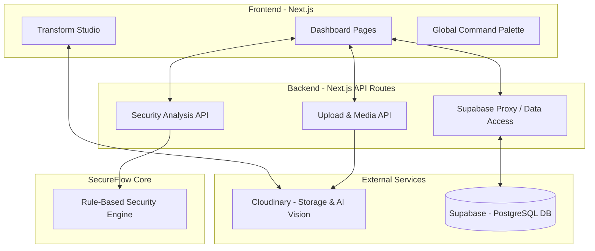

# System Architecture

SecureFlow AI is built on a modern, serverless stack designed for performance, security, and developer velocity.

## Core Technologies

- **Framework**: Next.js 14+ (App Router)
- **Language**: TypeScript
- **Styling**: Tailwind CSS & Framer Motion
- **Database / Auth**: Supabase (PostgreSQL)
- **Media Management**: Cloudinary
- **Icons**: Lucide React

## Architecture Diagram

## Key Components

1. **Next.js App Router**: Handles routing, server-side rendering, and provides the API endpoints.
2. **Cloudinary**: Acts as the primary media storage and AI feature extraction layer. It handles heavy lifting for media transformations and initial AI analysis (OCR, Tagging).
3. **SecureFlow Engine**: A custom, local TypeScript-based engine that evaluates Cloudinary's extracted metadata against security rules. It replaces the need for external LLM dependencies.
4. **Supabase**: Provides a scalable PostgreSQL database for storing analysis results and evidence records. It also handles Row Level Security (RLS) policies.
5. **UI Layer**: Built with Tailwind CSS for utility-first styling and Framer Motion for fluid, interactive animations, creating a premium user experience.
